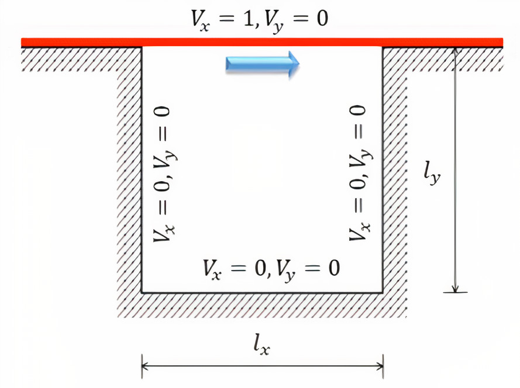

# Lid-driven cavity flow simulation

Lid-driven cavity flow is a well known problem in the field of fluid dynamics. It is commonly used as a benchmark problem to verify new simulation methods for incompressible viscous flows. 

The problem can be described as follows. Consider the two-dimensional domain depicted in the image above, we have a closed cavity with side lengths lx=ly= 1. The top wall (the lid) is moving in the positive x-direction with a constant unit velocity (Vx). The other three walls are stationary, and the velocities in the y-direction (Vy) are zero for all the walls. The cavity is filled with an incompressible, viscous fluid in which a flow is induced by the moving lid.

The file [simulation.py](simulation.py) contains code to find the velocity and pressure profiles in the rectangular domain by solving for the _stream function_ and _vorticity field_ of the vorticity form of the Navier-Stokes equations. These equations are solved using the finite difference (FD) method in conjunction with relaxation and successive over-relaxation (SOR). Additional details, along with plots for different flow cases, can be found in the [report](report.pdf).
